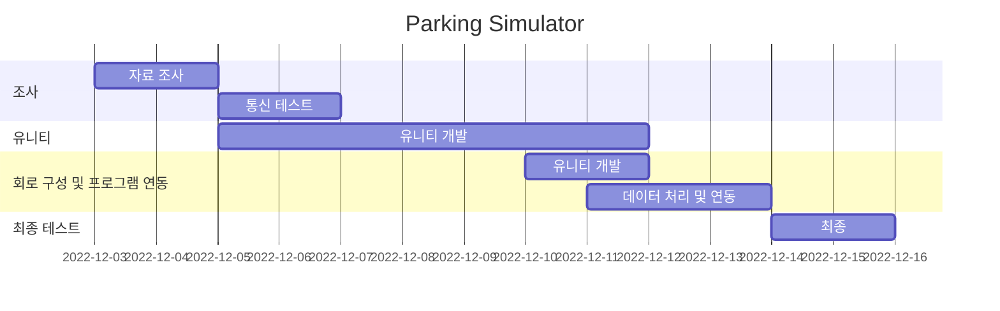

# ParkingSimulator
임베디드시스템 GNU - 주차 시뮬레이터

## 개발 일정(12/3 ~ 12/15)

```mermaid
gantt
    title Parking Simulator
    dateFormat  YYYY-MM-DD
    section 조사
    자료 조사           :a1, 2022-12-03, 2d
    통신 테스트     :after a1  , 2d
    section 유니티
    유니티 개발     :a2, 2022-12-05, 7d
    section 회로 구성 및 프로그램 연동
    유니티 개발     :a3, 2022-12-10, 2d
    데이터 처리 및 연동     :a4, 2022-12-11  , 3d
    section 최종 테스트
    최종     :after a4 , 2d
```
